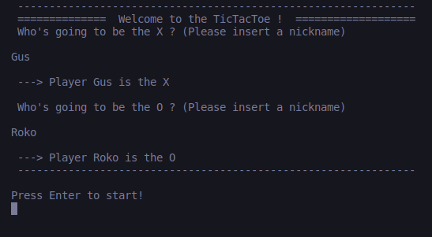
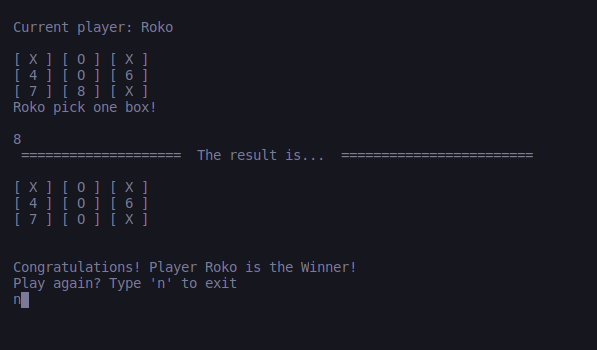

# TicTacToe
This Project is a TicTacToe game written in ruby, which can be played by two players, one being the `X` and the other being the `O`. 
The main goal is to fill a3x3 grid with those symbols, in which the winner is who can create a line with the same characters or we have a draw

 
## Built With

- RUBY

## Live Demo

To play the game, you need to visit the link above 
 - Select the `Shell` tab  on the top right of the repl.it page
 - Enter `ruby bin/main.rb` in the Shell tab and hit `Enter`

## Usage

Running this game locally will require the ruby language installed on your machine.
To play this game on the browser please visit the Live Demo section

- Donwload the game by cloning this repository `git clone https://github.com/RokoVarano/TicTacToe.git`
- Move to the directory where the file was downloaded
- Execute `bin/main.rb` on the terminal to start the game

## Testing Instructions

In order to run testing cases it's necesary to download rspec which can be downloaded [here](https://rspec.info/).

- Open file.
- On root folder run the command `rspec`.
- Whatch the results.

## Game Instructions

- After executing the game, The player is prompted by a welcome messege and asked to enter a nickname for `Player1`. Press `Enter` to complete
- Give a nickname for `Player2`and press `Enter` to complete
- The game starts with `Player1`, and it should pick a number between 1 ~ 9 which represents the postition of the where the `X` will be placed
- The next turn `Player2` should pick one of the avaliable positions, represented by the numbers on the board
- The player is neither allowed to overwrite a previously selected location nor entering inputs different of the numbers between 1 and 9

- The player who completes one row with the same symbol wins and the game ends.
- If no one completes a row and no movements are left, it is a draw and the game ends.

- Once the game ends, the players can type `n` to end the game or hit `Enter` to restart.

## Authors

👤 **Gustavo Carvalho**

- GitHub: [@gscarv13](https://github.com/gscarv13)
- Twitter: [@Gscarv13](https://twitter.com/Gscarv13)
- LinkedIn: [Gustavo Carvalho](https://www.linkedin.com/in/gustavo-silva-de-carvalho-72998a156/)

👤 **Rodrigo Ibaceta**

- GitHub: [Rodrigo Ibateca](https://github.com/RokoVarano/)
- Twitter: [@Rodrigo](https://twitter.com/RodrigoIbacet11)
- LinkedIn: [LinkedIn](https://www.linkedin.com/in/rodrigo-ibaceta-a8657611a/)

👤 **Luis Angulo**

- GitHub: [@pipe2442](https://https://github.com/pipe2442)
- Twitter: [@donCodigo_](https://twitter.com/donCodigo_)
- LinkedIn: [LinkedIn](https://www.linkedin.com/in/pipe2442/)

## 🤝 Contributing

Contributions, issues, and feature requests are welcome!

## Show your support

Give a ⭐️ if you like this project!

## Acknowledgments

Thanks for the both parties involved in the development of this project.
